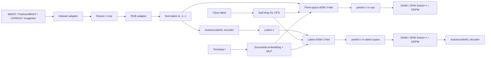
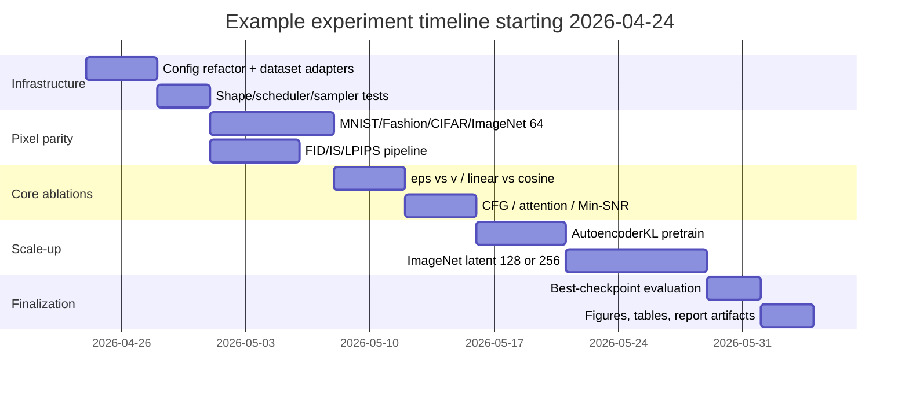

# Redesigning ImageReconstruction for Dataset-Universal Diffusion

## Executive summary

The current `kalebcoleman/ImageReconstruction` diffusion path is a clean, reproducible MNIST-family baseline rather than a general image-generation stack. It currently registers only MNIST and Fashion-MNIST aliases, applies a one-channel diffusion normalization transform, instantiates a 3-level grayscale U-Net written for 28×28 inputs, samples tensors shaped `(N, 1, 28, 28)`, and evaluates diffusion mainly with denoising-style MSE/PSNR/SSIM rather than generative metrics such as FID, IS, or LPIPS. At the same time, the repo already has good foundations worth preserving: safe Slurm workflows, isolated run directories, config logging, EMA support, checkpointing, and artifact generation. fileciteturn8file0L1-L1 fileciteturn9file0L1-L1 fileciteturn10file0L1-L1 fileciteturn11file0L1-L1 fileciteturn12file0L1-L1 fileciteturn13file0L1-L1 fileciteturn14file0L1-L1 fileciteturn15file0L1-L1

The strongest redesign is an ADM-style residual U-Net family, not a first-step replacement with a pure Transformer backbone. The proposed stack should use class conditioning plus classifier-free guidance, sinusoidal timestep embeddings, adaptive GroupNorm / FiLM-style scale-shift conditioning, selective self-attention at low resolutions, cosine noise schedules, EMA, DDIM and DPM-Solver++ sampling, and Min-SNR weighting. That combination is the closest practical synthesis of the most useful ideas from DDPM, DDIM, Improved DDPM, score-SDEs, ADM / Guided Diffusion, classifier-free guidance, latent diffusion, EDM, and recent training/sampling accelerators. citeturn3view0turn1search2turn1search1turn1search0turn5search2turn3view1turn4view0turn9search0turn8view0turn7search0turn19view0

Because the target ImageNet resolution, available GPUs, and training budget are unspecified, the most defensible plan is to support two first-class backends under one identical training API: a **pixel-space benchmark model** for all four datasets at a common 64×64 resolution, and a **latent-space scalable model** for ImageNet at 128×128 or 256×256 while still remaining runnable on MNIST, FashionMNIST, and CIFAR with the same code path. That gives you one apples-to-apples benchmark track and one production-quality scaling track. citeturn4view0turn4view1turn9search0

## Repository audit and design goals

The practical implication of the current code is simple: the repo is already structured like a good experiment harness, but the diffusion subsystem is tightly coupled to grayscale MNIST-style data. The refactor should therefore preserve the run logging and Slurm ergonomics, but replace the hard-coded data/model assumptions with a dataset adapter layer, config-driven architectures, modern samplers, and a real generative evaluation suite. fileciteturn8file0L1-L1 fileciteturn9file0L1-L1 fileciteturn10file0L1-L1 fileciteturn12file0L1-L1 fileciteturn13file0L1-L1

| Area | Current repository state | What must change |
|---|---|---|
| Data support | MNIST / FashionMNIST only, grayscale-first transforms | Add CIFAR-10 and ImageNet loaders, unified RGB adapter, resolution adapters |
| Backbone | 28×28 grayscale U-Net | Configurable ADM-style U-Net with attention and conditioning |
| Objective | Noise MSE only | Support `eps` and `v` prediction; optional learned sigma |
| Sampling | Ancestral DDPM only | Add DDIM and DPM-Solver++ |
| Conditioning | None | Add class embeddings + null-conditioning dropout for CFG |
| Metrics | MSE / PSNR / SSIM reconstruction metrics | Add FID, IS, LPIPS, plus paired denoising metrics |
| Reproducibility | Already good | Keep output structure, add YAML configs, tests, and reference stats |

The broader connected-repo pattern is also useful. In `ai-multitool-assistant`, the README emphasizes explicit environment setup and modular layering; in `nau-capstone`, the repo layout is deliverable-oriented and easy to navigate; in `nau-course-scraping`, the README explicitly calls out runnable tests. Those are the most transferable engineering norms to bring into ImageReconstruction: clear environments, opinionated repo structure, and smoke tests that protect the experiment surface. fileciteturn7file0L1-L1 fileciteturn16file0L1-L1 fileciteturn17file0L1-L1

The design goals should therefore be: one config schema across datasets, one conditioning interface across pixel and latent models, one evaluation harness, one artifact layout, and only a small number of architecture presets that scale by resolution instead of forking the codebase.

## Literature survey and architectural conclusions

Official reference implementations from entity["organization","OpenAI","ai research company"] and entity["organization","CompVis","computer vision lab"], together with the score-based work associated with entity["company","Google","technology company"], point to a stable conclusion: for a repo that must train on very small datasets and also scale toward ImageNet, the safest high-performance backbone is still a conditioned U-Net family, with latent-space diffusion added for higher resolutions and Transformers treated as a later optional backend rather than the first rewrite. citeturn15view0turn16view1turn16view0turn1search0turn4view0turn4view1

| Family | What it contributed | What to adopt in ImageReconstruction | Why it matters here |
|---|---|---|---|
| DDPM | Canonical denoising objective and discrete forward/reverse process | Keep the fundamental training loop based on random timesteps and denoising targets | It is the best bridge from the current repo to a stronger design. citeturn3view0 |
| DDIM | Same training objective, much faster deterministic or semi-deterministic sampling | Make DDIM-50 the default evaluation sampler | It gives a strong speed/quality baseline without retraining. citeturn1search2 |
| Improved DDPM | Learned variances, cosine schedules, compute scaling, better samplers | Use cosine schedules by default; keep learned sigma as an option | It is the most directly reusable improvement over a plain DDPM baseline. citeturn1search1turn16view1 |
| Score-SDE | Continuous-time view, predictor-corrector and ODE framing | Use it as the conceptual basis for modern samplers, not as the first implementation target | It explains why DPM-Solver-style samplers work well. citeturn1search0turn7search1 |
| ADM / Guided Diffusion | Strong U-Net ablations, attention placement, class conditioning, scale-shift norm | Make ADM-style residual U-Net the primary backbone | It is the best “top-tier but practical” architecture family for this repo. citeturn5search2turn15view0 |
| Classifier guidance | Fidelity/diversity trade-off via an external classifier | Do **not** make this the default path | It improves conditional quality, but adds another model and more complexity. citeturn5search2 |
| Classifier-free guidance | Conditional + unconditional training in one model | Make CFG the default conditioning strategy | It is simpler and more general than external classifier guidance. citeturn3view1turn16view0 |
| Latent Diffusion | Compress image space, diffuse in learned latents, add cross-attention | Make LDM the scaling path for ImageNet 128/256 | It is the cleanest way to keep ImageNet tractable without abandoning the repo’s PyTorch simplicity. citeturn4view0turn16view0 |
| DiT | Excellent scaling in latent space with Transformer backbones | Keep as a future backend, not the first refactor | It is powerful, but it is less natural for MNIST/Fashion-scale parity experiments and heavier to engineer initially. citeturn4view1 |
| EDM / Min-SNR / DPM-Solver++ | Better preconditioning, faster convergence, fewer sampling steps | Use Min-SNR in training and DPM-Solver++ in fast eval | These are the highest-leverage 2022–2024 efficiency upgrades. citeturn9search0turn8view0turn7search0 |

The practical conclusion is that the repository should target an **ADM/LDM hybrid design philosophy**:

- **Backbone:** ADM-style residual U-Net
- **Conditioning:** classifier-free guidance with label embeddings and null-token dropout
- **Normalization:** GroupNorm with scale-shift conditioning
- **Attention:** low-resolution self-attention; optional cross-attention
- **Objective:** default `v`-prediction, with `eps` as an ablation and compatibility mode
- **Training acceleration:** EMA + Min-SNR
- **Sampling:** DDIM for standard evaluation, DPM-Solver++ for fast evaluation, ancestral DDPM for best-quality reference runs

That is the smallest redesign that is still meaningfully “top-tier.”

## Proposed architecture

The proposed flow below intentionally keeps one dataset adapter and one conditioning interface for both backends. It is designed to preserve the current repo’s experiment ergonomics while modernizing the denoiser, sampler, and evaluation stack. The architectural ingredients come directly from the cited DDPM, Improved DDPM, Guided Diffusion, CFG, LDM, EDM, and Min-SNR lines. citeturn3view0turn1search1turn15view0turn3view1turn4view0turn9search0turn8view0



### Pixel-space variant

This is the strict parity model for running **identical 64×64 experiments** across MNIST, FashionMNIST, CIFAR-10, and ImageNet. It is also the cleanest first implementation milestone.

**Default pixel-space denoiser: `ADMUNet64`**

| Stage | Resolution | Channels | Blocks | Attention | Conditioning |
|---|---:|---:|---|---|---|
| Input stem | 64×64 | 128 | 3×3 conv | No | — |
| Down stage A | 64×64 | 128 | 2× ResBlock | No | AdaGN from time + class |
| Downsample | 32×32 | 256 | Strided conv or resblock-updown | No | — |
| Down stage B | 32×32 | 256 | 2× ResBlock | Optional for ImageNet-64 | AdaGN |
| Downsample | 16×16 | 384 | Strided conv or resblock-updown | No | — |
| Down stage C | 16×16 | 384 | 2× ResBlock | MHSA + optional cross-attn | AdaGN |
| Downsample | 8×8 | 512 | Strided conv or resblock-updown | No | — |
| Down stage D | 8×8 | 512 | 2× ResBlock | MHSA + optional cross-attn | AdaGN |
| Middle | 8×8 | 512 | ResBlock → MHSA → optional cross-attn → ResBlock | Yes | AdaGN |
| Up stage D | 16×16 | 384 | Upsample + skip concat + 2× ResBlock | MHSA + optional cross-attn | AdaGN |
| Up stage C | 32×32 | 256 | Upsample + skip concat + 2× ResBlock | Optional for ImageNet-64 | AdaGN |
| Up stage B | 64×64 | 128 | Upsample + skip concat + 2× ResBlock | No | AdaGN |
| Output head | 64×64 | 3 or 6 | GN → SiLU → 3×3 conv | No | — |

**Global defaults**

| Hyperparameter | Default |
|---|---|
| Input channels | 3 |
| Output prediction | `v` by default; optional `eps`; optional `learn_sigma=True` for `2*C` outputs |
| Base width | 128 |
| Channel multipliers | `[1, 2, 3, 4]` |
| ResBlocks per stage | 2 |
| Timestep embedding dim | 512 |
| Class embedding dim | 512 |
| Attention heads | 8 total, low-resolution only |
| Dropout | 0.1 |
| CFG null-conditioning drop | 0.1 |
| Norm | GroupNorm + scale-shift modulation |
| Activation | SiLU |
| Sampling resolutions with attention | 16 and 8 by default; add 32 for harder ImageNet settings |

This design is intentionally close to Guided Diffusion’s practical flags such as selective attention, learned sigma, `resblock_updown`, fp16 support, and `use_scale_shift_norm`, while avoiding needless complexity in the first refactor. citeturn15view0turn16view1

### Latent-space variant

This is the scalable path for ImageNet once you move beyond strict 64×64 parity. It should also remain runnable on the smaller datasets so the entire repo still shares one experiment surface.

**First-stage autoencoder: `AutoencoderKL-f8-z4`**

| Stage | Resolution | Channels | Blocks |
|---|---:|---:|---|
| Encoder stem | S×S | 128 | 3×3 conv |
| Enc stage A | S×S | 128 | 2× ResBlock |
| Downsample | S/2 | 128 | Conv downsample |
| Enc stage B | S/2 | 256 | 2× ResBlock |
| Downsample | S/4 | 256 | Conv downsample |
| Enc stage C | S/4 | 512 | 2× ResBlock + MHSA |
| Downsample | S/8 | 512 | Conv downsample |
| Latent heads | S/8 | 8 total | 4-channel `mu` + 4-channel `logvar` |
| Sampled latent | S/8 | 4 | Reparameterized `z` |
| Decoder | mirror | mirror | Symmetric up path |

**Latent denoiser: `LDMUNet-f8`**

| Stage | Latent resolution | Channels | Blocks | Attention |
|---|---:|---:|---|---|
| Input stem | S/8 | 192 | 3×3 conv | No |
| Down A | S/8 | 192 | 2× ResBlock | Optional |
| Down B | S/16 | 384 | 2× ResBlock | Yes |
| Down C | S/32 | 768 | 2× ResBlock | Yes |
| Middle | S/32 | 768 | ResBlock → MHSA → cross-attn → ResBlock | Yes |
| Up C | S/16 | 384 | Upsample + skip + 2× ResBlock | Yes |
| Up B | S/8 | 192 | Upsample + skip + 2× ResBlock | Yes |
| Output head | S/8 | 4 | GN → SiLU → 3×3 conv | No |

**Recommended latent presets**

| Preset | Real image size | Latent size | Use case |
|---|---:|---:|---|
| `ldm64` | 64×64 | 8×8×4 | Cross-dataset parity experiments |
| `ldm128` | 128×128 | 16×16×4 | Moderate ImageNet budget |
| `ldm256` | 256×256 | 32×32×4 | Recommended scalable ImageNet path |

The reason to keep this second path is exactly the one argued by latent diffusion: compressing perceptually meaningful image structure before diffusion drastically reduces training and inference cost while preserving flexibility, and cross-attention makes the same denoiser architecture extensible to richer conditioning later. citeturn4view0turn16view0

### Design choices and rationale

| Choice | Recommendation | Rationale |
|---|---|---|
| Backbone | ADM-style residual U-Net | Best trade-off between small-data robustness, ImageNet readiness, and compatibility with current code |
| Conditioning | Class embedding + CFG | Uses labels from all four datasets without training a separate classifier |
| Norm / modulation | GroupNorm + scale-shift | Stable under small batches and stronger than additive-only conditioning |
| Attention | 16 and 8 for 64×64; add 32 for harder ImageNet | Captures long-range structure at affordable memory cost |
| Cross-attention | Keep modular and optionally enabled | Needed for future text/metadata conditioning; safe to keep lightweight now |
| Prediction target | `v` default, `eps` as ablation | Better low-step behavior is consistent with modern practice and recent sampling work |
| Schedule | Cosine default; linear as baseline | Stronger baseline than plain linear DDPM |
| Loss weighting | Min-SNR-γ, `γ=5` | Faster and more balanced optimization across timesteps |
| EMA | 0.9999 | Essential for good sample quality; align with diffusion practice |
| Samplers | DDIM-50, DPM-Solver++-20, DDPM-250 | Gives a clean speed/quality ladder |

The table above is a synthesis of DDPM, Improved DDPM, Guided Diffusion, CFG, LDM, EDM, and recent fast-sampling / faster-training results. citeturn3view0turn1search1turn15view0turn3view1turn4view0turn9search0turn8view0turn7search0turn19view0

## Standardized training and evaluation protocol

A truly identical experiment suite requires one common image interface. The cleanest benchmark choice is: **convert every dataset to 64×64 RGB-like tensors in `[-1, 1]`** for pixel-space parity runs. MNIST and Fashion-MNIST are 28×28 grayscale with 60k/10k splits; CIFAR-10 is the standard torchvision RGB dataset at 32×32; ImageNet in torchvision follows the ILSVRC2012 train/val structure and must be prepared locally. citeturn12search2turn12search0turn14search4turn14search0

### Dataset preprocessing and augmentation

| Dataset | Benchmark transform | Practical augmentation | Notes |
|---|---|---|---|
| MNIST | Resize to 64, replicate 1→3 channels, normalize to `[-1,1]` | None by default | Keep orientation unchanged |
| FashionMNIST | Resize to 64, replicate 1→3 channels, normalize to `[-1,1]` | None by default | Keep benchmark strict and simple |
| CIFAR-10 | Resize 32→64, normalize to `[-1,1]` | Random crop from 72→64, horizontal flip 0.5 | Stronger than raw resize for scaled runs |
| ImageNet | RandomResizedCrop / CenterCrop at target size, normalize to `[-1,1]` | Standard random resized crop + optional horizontal flip | Use 64 for parity, 128/256 for scalable runs |

The practical recommendation is to maintain **two recipe families**:

### Common parity recipe

This is the one to use when the goal is “train identically across MNIST, FashionMNIST, CIFAR, and ImageNet.”

| Setting | Value |
|---|---|
| Backend | `pixel_adm_unet` |
| Resolution | 64×64 |
| Channels | 3 |
| Conditioning | class-conditional + CFG |
| Timesteps | 1000 |
| Schedule | cosine |
| Prediction | `v` |
| Objective | MSE on `v` |
| Weighting | Min-SNR-γ, `γ=5` |
| Optimizer | AdamW |
| Learning rate | `2e-4` |
| Betas | `(0.9, 0.999)` |
| Weight decay | `1e-2` |
| EMA | `0.9999` |
| Gradient clip | `1.0` |
| Mixed precision | bf16 preferred, fp16 fallback |
| Global batch target | 256 |
| Eval samplers | DDIM-50, DPM-Solver++-20, DDPM-250 |
| CFG evaluation scales | `0.0`, `1.5`, `3.0`, `5.0` |
| Checkpoint cadence | every 10k steps |
| Best-model criterion | lowest validation FID, tie-break by LPIPS + sample inspection |

### Scaled production recipe

| Scenario | Backend | Resolution | Base width | Batch target | LR |
|---|---|---:|---:|---:|---:|
| MNIST / Fashion / CIFAR strong baseline | Pixel ADM | 64 | 128 | 256 | `2e-4` |
| ImageNet parity | Pixel ADM | 64 | 128 or 192 | 256 | `2e-4` |
| ImageNet moderate | LDM | 128 | 192 | 256 | `1e-4` |
| ImageNet recommended | LDM | 256 | 192 or 256 | 128–256 | `1e-4` |

### Reproducible config skeleton

```yaml
experiment:
  name: mnist_pixel64_cfg
  seed: 42

dataset:
  name: mnist
  root: ./data
  image_size: 64
  channels: 3
  grayscale_to_rgb: true
  split_train: train
  split_eval: test

model:
  backend: pixel_adm_unet
  base_channels: 128
  channel_mult: [1, 2, 3, 4]
  num_res_blocks: 2
  attention_resolutions: [16, 8]
  class_cond: true
  class_dropout_prob: 0.1
  use_scale_shift_norm: true
  prediction_type: v
  learn_sigma: false

diffusion:
  train_timesteps: 1000
  noise_schedule: cosine
  min_snr_gamma: 5.0

train:
  optimizer: adamw
  lr: 2.0e-4
  betas: [0.9, 0.999]
  weight_decay: 1.0e-2
  ema_decay: 0.9999
  grad_clip_norm: 1.0
  amp_dtype: bf16
  global_batch_size: 256
  max_steps: 200000

eval:
  samplers:
    - {name: ddim, steps: 50}
    - {name: dpm_solver_pp, steps: 20}
    - {name: ddpm, steps: 250}
  cfg_scales: [0.0, 1.5, 3.0, 5.0]
  num_samples_fid: 50000
```

### Evaluation protocol

FID comes from TTUR / FID, Inception Score from the GAN literature, LPIPS from the perceptual-distance paper, and SSIM from the original SSIM paper. For diffusion specifically, use **FID and LPIPS as primary generative metrics**, use **IS as a secondary metric**, and reserve **PSNR / SSIM / paired LPIPS** for denoise-to-`x0` or reconstruction-style evaluations where a ground-truth target exists. citeturn11search0turn10search4turn10search9turn10search0

| Metric | Use it for | Script behavior |
|---|---|---|
| FID | Primary quality metric | Generate 50k samples per checkpoint; compare against versioned reference stats for the exact eval transform |
| IS | Secondary diversity/confidence metric | Report mainly for CIFAR / ImageNet; treat as secondary on MNIST/Fashion |
| LPIPS | Perceptual diversity / paired reconstruction | Compute on denoised reconstructions and optional interpolation suites |
| PSNR | Paired fidelity only | Compute on fixed-timestep denoise-to-`x0` recovery |
| SSIM | Paired structural fidelity only | Same paired evaluation protocol as PSNR |

**Required scripts**

| Script | Purpose |
|---|---|
| `evaluate/generate_samples.py` | Produce sample sets for a checkpoint / sampler / CFG scale |
| `evaluate/fid_is.py` | Compute FID and IS from generated samples |
| `evaluate/reconstruction_metrics.py` | Compute LPIPS, PSNR, SSIM on paired denoising samples |
| `evaluate/visualize.py` | Render grids, reverse-process strips, nearest-neighbor retrievals, and interpolation panels |

## Codex-ready implementation blueprint

The implementation should preserve the current strengths of ImageReconstruction: a single training entrypoint, isolated run directories, saved config, checkpoints, logs, metrics, Slurm friendliness, and demo-ready plots. fileciteturn8file0L1-L1 fileciteturn9file0L1-L1 fileciteturn15file0L1-L1

### Target file layout

```text
ImageReconstruction/
├── configs/
│   ├── pixel/
│   │   ├── mnist64.yaml
│   │   ├── fashion64.yaml
│   │   ├── cifar64.yaml
│   │   └── imagenet64.yaml
│   └── latent/
│       ├── mnist64.yaml
│       ├── fashion64.yaml
│       ├── cifar64.yaml
│       ├── imagenet128.yaml
│       └── imagenet256.yaml
├── diffusion/
│   ├── backbones/
│   │   ├── adm_unet.py
│   │   └── latent_unet.py
│   ├── autoencoders/
│   │   └── autoencoder_kl.py
│   ├── modules/
│   │   ├── embeddings.py
│   │   ├── resblock.py
│   │   ├── attention.py
│   │   ├── conditioning.py
│   │   └── norms.py
│   ├── schedules.py
│   ├── losses.py
│   ├── samplers/
│   │   ├── ddim.py
│   │   ├── dpm_solver_pp.py
│   │   └── ancestral.py
│   ├── ema.py
│   └── training.py
├── data/
│   ├── datasets.py
│   ├── transforms.py
│   └── reference_stats.py
├── evaluate/
│   ├── fid_is.py
│   ├── reconstruction_metrics.py
│   ├── visualize.py
│   └── nearest_neighbors.py
├── tests/
│   ├── test_shapes.py
│   ├── test_scheduler.py
│   ├── test_cfg.py
│   ├── test_samplers.py
│   ├── test_dataset_adapters.py
│   └── test_metrics_smoke.py
└── train.py
```

### Required classes and function signatures

```python
class ADMUNet(nn.Module):
    def __init__(
        self,
        in_channels: int,
        out_channels: int,
        image_size: int,
        base_channels: int,
        channel_mult: list[int],
        num_res_blocks: int,
        attention_resolutions: list[int],
        class_cond: bool,
        num_classes: int | None,
        class_dropout_prob: float,
        use_scale_shift_norm: bool = True,
        predict_variance: bool = False,
        prediction_type: str = "v",
    ) -> None: ...
    def forward(
        self,
        x: torch.Tensor,
        timesteps: torch.Tensor,
        y: torch.Tensor | None = None,
        force_uncond: bool = False,
    ) -> torch.Tensor: ...

class AutoencoderKL(nn.Module):
    def encode(self, x: torch.Tensor) -> tuple[torch.Tensor, torch.Tensor]: ...
    def reparameterize(self, mu: torch.Tensor, logvar: torch.Tensor) -> torch.Tensor: ...
    def decode(self, z: torch.Tensor) -> torch.Tensor: ...
    def forward(self, x: torch.Tensor) -> dict[str, torch.Tensor]: ...

def build_dataset(
    name: str,
    root: str,
    split: str,
    image_size: int,
    channels: int,
    download: bool = False,
) -> Dataset: ...

def build_noise_schedule(
    schedule_name: str,
    num_timesteps: int,
    device: torch.device,
) -> object: ...

def diffusion_loss(
    model_output: torch.Tensor,
    target: torch.Tensor,
    timesteps: torch.Tensor,
    prediction_type: str,
    min_snr_gamma: float | None = None,
) -> torch.Tensor: ...

def sample_ddim(...): ...
def sample_dpm_solver_pp(...): ...
def sample_ddpm(...): ...

def compute_fid_is(...): ...
def compute_reconstruction_metrics(...): ...
def save_sample_grid(...): ...
def save_reverse_process_strip(...): ...
```

### Dependencies

```text
torch
torchvision
einops
omegaconf
pyyaml
tqdm
numpy
scipy
matplotlib
torchmetrics
lpips
clean-fid
pytest
```

### Test requirements

| Test | Must verify |
|---|---|
| `test_shapes.py` | Pixel and latent backbones return expected shapes for MNIST/Fashion/CIFAR/ImageNet configs |
| `test_scheduler.py` | Cosine and linear schedules are monotonic and numerically stable |
| `test_cfg.py` | Conditional and unconditional forward passes both run |
| `test_samplers.py` | DDIM and DPM-Solver++ smoke tests produce finite outputs |
| `test_dataset_adapters.py` | Grayscale→RGB conversion and size transforms are correct |
| `test_metrics_smoke.py` | FID/IS/LPIPS/PSNR/SSIM pipeline runs on toy inputs |

### Codex-ready implementation prompt

```text
Modify kalebcoleman/ImageReconstruction into a config-driven diffusion training repo.

Primary goal:
- Add a top-tier diffusion stack that trains through the same public API on MNIST, FashionMNIST, CIFAR10, and ImageNet.
- Preserve the current training ergonomics: single train.py entrypoint, isolated output dirs, saved config, train.log, metrics.jsonl, metrics.json, checkpoints, and sample/plot artifacts.

Required backends:
1) Pixel-space ADM-style U-Net for 64x64 parity experiments.
2) Latent diffusion backend with AutoencoderKL and latent ADM-style U-Net for scalable ImageNet training.

Required features:
- Dataset adapters for MNIST, FashionMNIST, CIFAR10, ImageNet
- Resize/crop pipeline to 64x64 for parity configs
- Optional 128x128 and 256x256 latent configs for ImageNet
- Class-conditional training with classifier-free guidance
- Sinusoidal timestep embeddings
- GroupNorm + scale-shift conditioning
- Selective self-attention at low resolutions
- Optional cross-attention module that can consume label tokens now and text tokens later
- Cosine and linear schedules
- Support prediction_type in {"eps", "v"}
- Optional learned sigma output head
- Min-SNR weighting
- EMA
- Samplers: DDPM, DDIM, DPM-Solver++
- Evaluation scripts: FID, IS, LPIPS, PSNR, SSIM
- Visualization scripts: sample grids, reverse-process strips, interpolation grids, nearest-neighbor retrievals
- Pytest smoke tests

Compatibility requirements:
- Keep current CLI aliases working where possible
- Keep output directory structure compatible with current README expectations
- Keep Slurm-safe behavior
- Default to no automatic ImageNet download
- Save every resolved config to JSON and YAML
- Version reference statistics used for FID

Create the file tree exactly as proposed in the implementation plan.
Use modern typing throughout.
Add docstrings for every public class/function.
Use bf16 if available, fp16 otherwise.
Make image channels configurable but default to 3 for all diffusion configs.
Implement tests first for shapes, schedulers, samplers, dataset adapters, and metrics smoke runs.
```

## Compute, ablations, and timeline

### Expected compute and scaling guidance

Because GPU type and budget are unspecified, the table below should be read as **planning estimates**, not measured benchmarks.

| Run type | Typical fit target | Estimated VRAM | Estimated GPU-hours |
|---|---|---:|---:|
| Pixel ADM 64×64 parity run | 1× 16–24 GB GPU with microbatching | 12–20 GB | 12–30 GPUh |
| Pixel ADM 64×64 wider ImageNet run | 1× 24–40 GB GPU | 18–28 GB | 20–45 GPUh |
| LDM 64×64 parity run | 1× 16–24 GB GPU | 10–18 GB | 8–20 GPUh plus AE pretrain |
| LDM 128×128 ImageNet | 1× 24–40 GB GPU | 18–30 GB | 30–80 GPUh plus AE pretrain |
| LDM 256×256 ImageNet | 1× 40–80 GB GPU or multi-GPU | 28–60 GB | 80–250 GPUh plus AE pretrain |

### Resource guidance by hardware tier

| Hardware tier | Recommendation |
|---|---|
| 1× 12–16 GB | Pixel-64 only, base width 96–128, microbatch 8–16, gradient checkpointing |
| 1× 24 GB | Pixel-64 strong baseline or LDM-64 / LDM-128 light |
| 1× 40–80 GB | LDM-128 or LDM-256 becomes realistic |
| Multi-GPU | Keep global batch fixed; scale with DDP or FSDP, not by silently changing learning dynamics |

### Ablation matrix and success criteria

| Ablation | Compare | Success criterion |
|---|---|---|
| Prediction target | `eps` vs `v` | `v` wins if DDIM-50 and DPM++-20 both improve or match FID |
| Schedule | linear vs cosine | cosine wins if convergence is faster and final FID is lower |
| Weighting | plain MSE vs Min-SNR | Min-SNR wins if target FID is reached in fewer steps or with lower final loss |
| Conditioning | unconditional vs CFG | CFG wins if FID improves without obvious diversity collapse |
| Norm modulation | additive time bias vs scale-shift norm | scale-shift wins if class-conditional quality improves consistently |
| Attention placement | none vs 16/8 vs 32/16/8 | choose smallest placement that preserves FID |
| Sampler | DDPM-250 vs DDIM-50 vs DPM++-20 | DPM++ wins if it stays within ~10% of best FID at much lower sampling cost |
| Space | pixel vs latent | latent wins for ImageNet if quality/compute is better at 128/256 |
| Learned sigma | off vs on | keep only if sampling quality justifies extra complexity |
| Autoencoder | no perceptual term vs LPIPS term | keep LPIPS if latent reconstructions stop washing out detail |

### Example experiment timeline



### Open questions and limitations

The most important unresolved inputs are the **target ImageNet resolution**, **available GPU memory / count**, and **true training budget**. Those choices determine whether ImageNet should stop at 64×64 pixel space, move to 128×128 latent diffusion, or jump directly to 256×256 latent diffusion. Without those inputs, the safest recommendation is: implement both backends now, benchmark everything at 64×64, and treat `LDM-256` as the main scale-up target rather than the default assumption.

### Primary sources and links

- *ImageReconstruction README* fileciteturn8file0L1-L1  
- *ImageReconstruction train.py* fileciteturn9file0L1-L1  
- *ImageReconstruction diffusion/model.py* fileciteturn10file0L1-L1  
- *ImageReconstruction diffusion/scheduler.py* fileciteturn11file0L1-L1  
- *ImageReconstruction diffusion/training.py* fileciteturn12file0L1-L1  
- *ImageReconstruction diffusion/sampling.py* fileciteturn13file0L1-L1  
- *ImageReconstruction diffusion/ema.py* fileciteturn14file0L1-L1  
- *ImageReconstruction Slurm README* fileciteturn15file0L1-L1  
- *ai-multitool-assistant README* fileciteturn7file0L1-L1  
- *nau-capstone README* fileciteturn16file0L1-L1  
- *nau-course-scraping README* fileciteturn17file0L1-L1  
- *DDPM* citeturn3view0  
- *DDIM* citeturn1search2  
- *Improved DDPM* citeturn1search1turn16view1  
- *Score-SDE* citeturn1search0  
- *ADM / Diffusion Models Beat GANs* citeturn5search2  
- *OpenAI guided-diffusion repository* citeturn15view0  
- *Classifier-Free Guidance* citeturn3view1  
- *Latent Diffusion Models* citeturn4view0turn16view0  
- *CompVis latent-diffusion repository* citeturn16view0  
- *DiT* citeturn4view1  
- *EDM* citeturn9search0  
- *Min-SNR weighting* citeturn8view0  
- *DPM-Solver and DPM-Solver++* citeturn7search1turn7search0  
- *Progressive Distillation* citeturn9search2  
- *Imagen Video for explicit v-parameterization mention* citeturn19view0  
- *MNIST* citeturn12search2turn14search8  
- *Fashion-MNIST* citeturn12search0turn14search7  
- *CIFAR-10 torchvision docs* citeturn14search4  
- *ImageNet torchvision docs* citeturn14search0  
- *FID* citeturn11search0  
- *Inception Score* citeturn10search4  
- *LPIPS* citeturn10search9  
- *SSIM* citeturn10search0