# PCA vs Autoencoders for Image Reconstruction

## Overview

This project compares PCA and autoencoder-based reconstruction methods. PCA is the classical dimensionality-reduction baseline, while autoencoders are the neural-network reconstruction approach.

The main focus is reconstruction quality for PCA vs autoencoders. VAE, interpolation, denoising, and diffusion results are included to show related extensions. Diffusion is an extra-credit generative extension, not the main focus of the project.

## Main Research Question

How do PCA and autoencoder-based models compare for image reconstruction quality across MNIST and Fashion-MNIST?

## Project Roles

- **PCA analysis and visuals**: teammate
- **Autoencoder, VAE/interpolation, denoising, and diffusion extension**: me

## Main Comparison: PCA vs Autoencoder

This section is reserved for the final PCA vs AE comparison once teammate PCA results are merged.

### PCA Reconstruction Grids

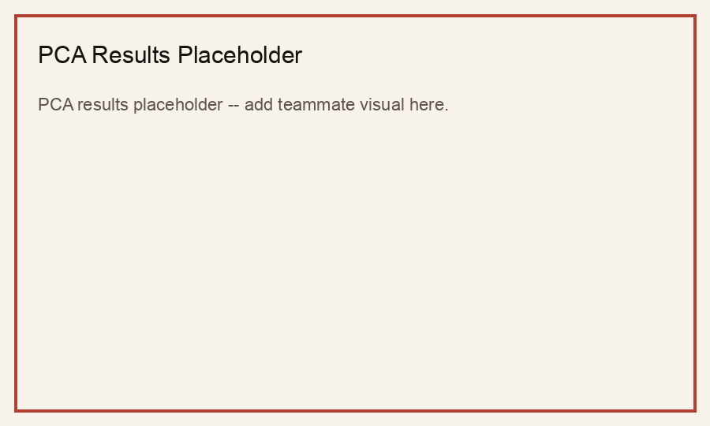


### AE Reconstruction Grids

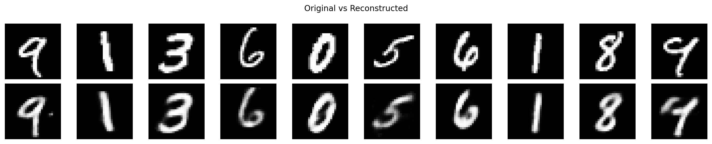


### Combined PCA vs AE Grids


### SSIM / PSNR / MSE Comparison Plots


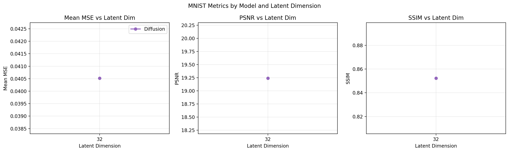

## Autoencoder Results

The regular autoencoder compresses each image into a lower-dimensional latent representation and reconstructs the image from that code. These results are the main neural-network comparison point against PCA.


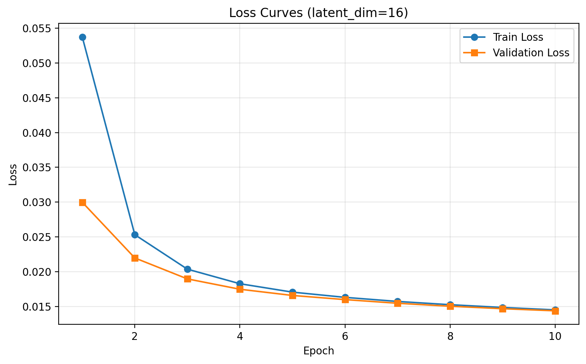

## VAE and Latent Space Results

The VAE extends the reconstruction model with a probabilistic latent space. This supports reconstruction, latent sampling, and interpolation between examples.

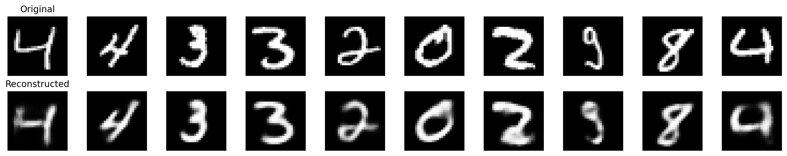

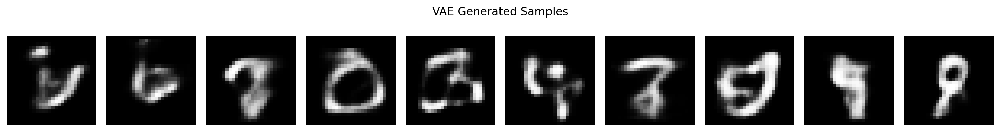

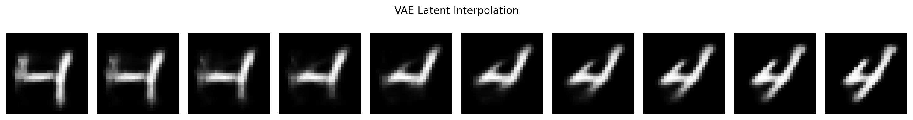

## Denoising Autoencoder / Noise Robustness

The denoising autoencoder tests whether the model can recover clean images from noisy inputs. This is useful for understanding robustness beyond direct reconstruction.

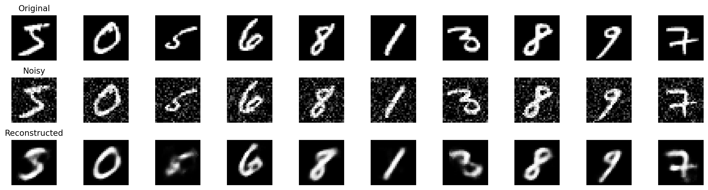

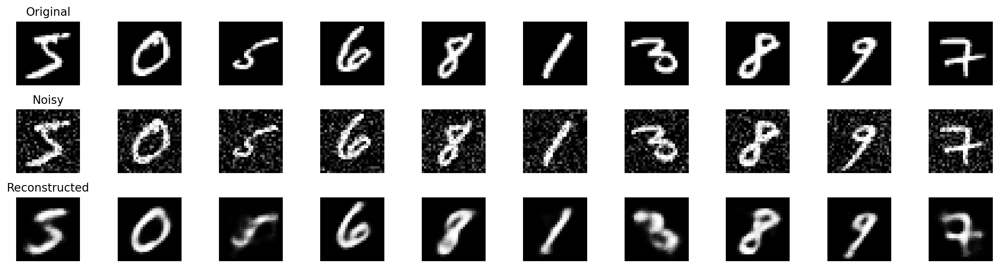


## Extra Credit Extension: Diffusion Model

Diffusion was added after the main PCA vs AE reconstruction work. It focuses on generation rather than reconstruction.

MNIST and Fashion-MNIST generations are stronger because they are simpler datasets: grayscale, low resolution, and less visually varied. CIFAR-10 is harder due to RGB channels, object complexity, backgrounds, and higher variation.

CIFAR samples should be viewed at actual `32x32` size and at nearest-neighbor enlarged size. The actual-size version preserves the model output, while nearest-neighbor enlargement keeps the pixels crisp instead of smoothing them into blur.

The diffusion model is intentionally lightweight, so imperfect CIFAR samples are expected.

### MNIST Diffusion Generations

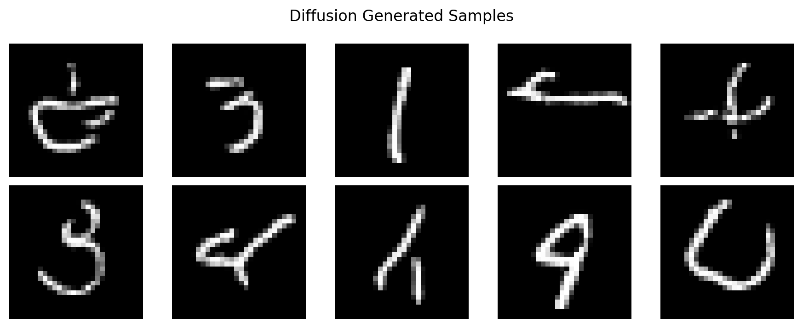

### Fashion-MNIST Diffusion Generations

Fashion-MNIST diffusion visuals were not found in the current local output folders. The overview grid below uses a placeholder tile until those outputs are added.

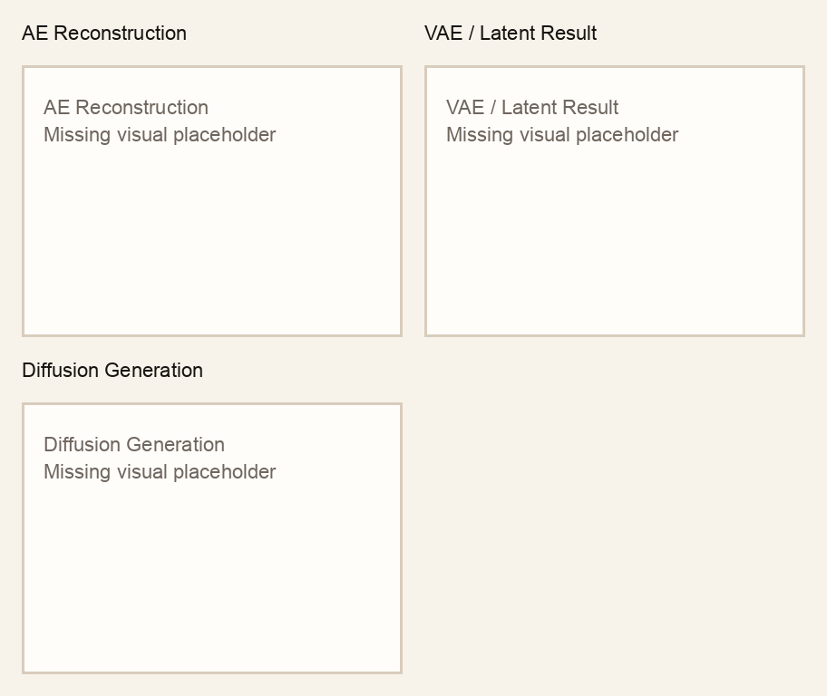

### CIFAR Actual-Size Generations

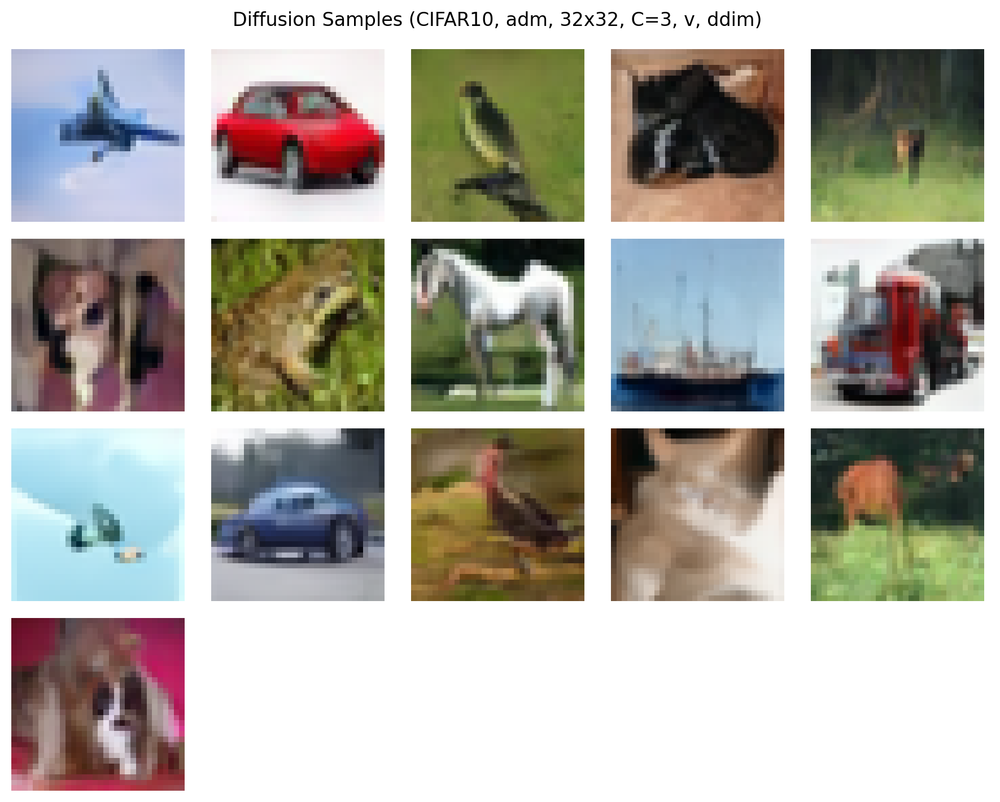

### CIFAR Nearest-Neighbor Enlarged Generations


### Combined Diffusion Overview

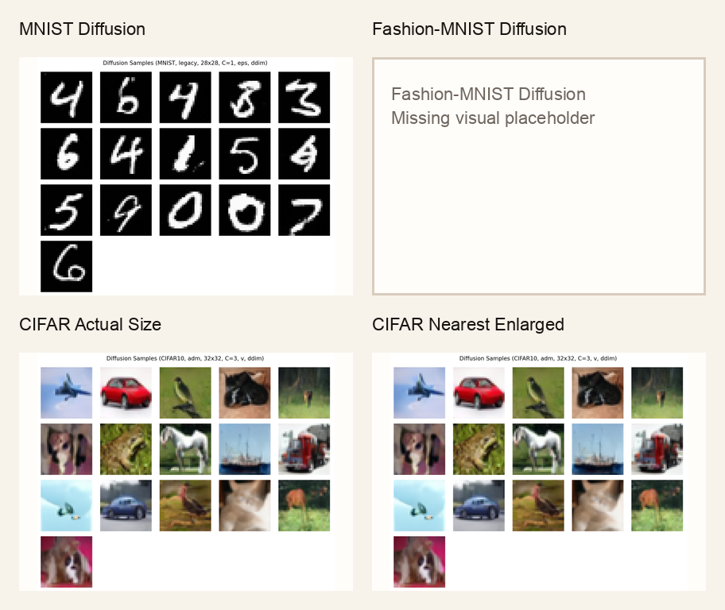

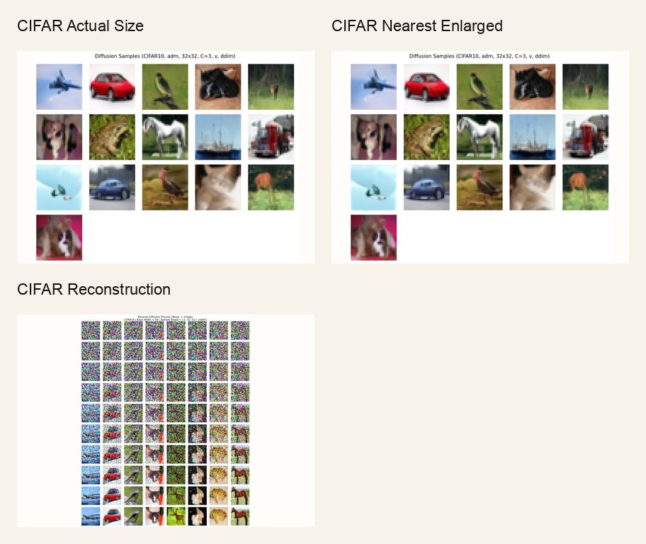

## Full Analysis Placeholder

Add the final written analysis here once PCA results are merged:

- PCA vs AE reconstruction quality
- Metric trends by latent dimension
- Strengths and weaknesses
- Final conclusions

## Limitations

- PCA results are pending from the teammate.
- The fully connected AE is limited on complex RGB data.
- CIFAR needs CNNs or larger models for better reconstruction and generation.
- Diffusion needs more compute and a larger architecture for stronger results.

## Future Work

- Merge PCA results.
- Create final PCA vs AE comparison grids.
- Add a CNN autoencoder for CIFAR.
- Improve diffusion with a larger UNet, attention, cosine noise schedule, EMA, and Monsoon GPU sweeps.

## How to Run

The repo supports AE, DAE, VAE, and diffusion runs through `train.py`. These examples use CLI arguments that already exist in the repo.

```bash
# Regular autoencoder
python train.py --model ae --dataset mnist --latent-dim 16

# Denoising autoencoder
python train.py --model dae --dataset mnist --latent-dim 16 --dae-noise-level 0.2

# Variational autoencoder
python train.py --model vae --dataset mnist --latent-dim 16

# Diffusion extension with existing configs
python train.py --config configs/diffusion/mnist.yaml
python train.py --config configs/diffusion/fashion.yaml
python train.py --config configs/diffusion/cifar10.yaml
```

Collect copied report assets and regenerate placeholders/grids:

```bash
python scripts/collect_report_assets.py
```
